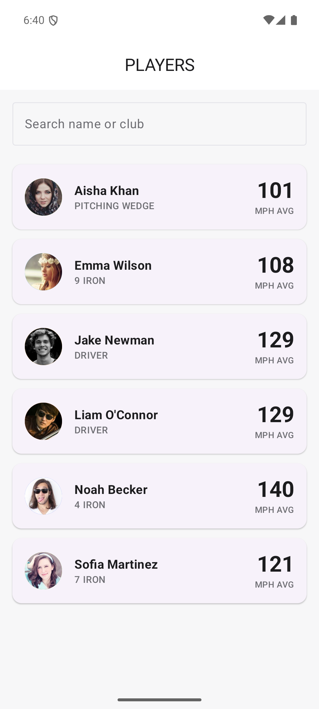
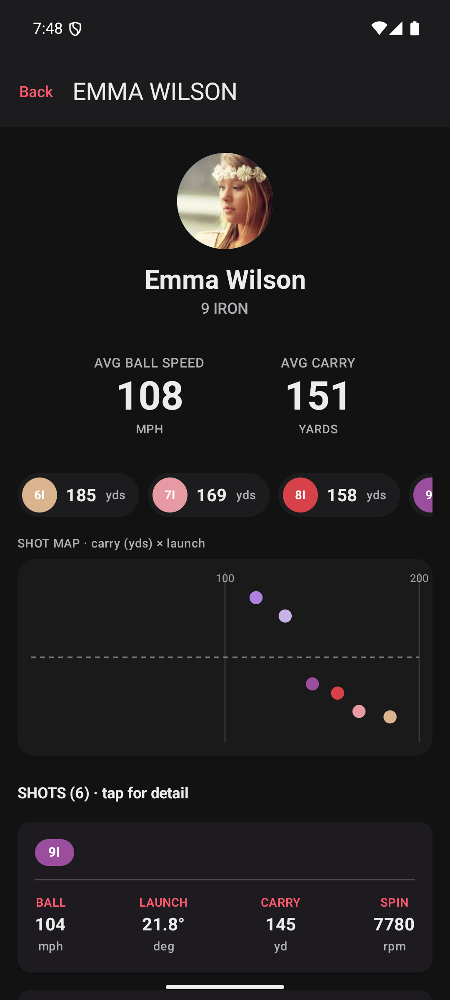
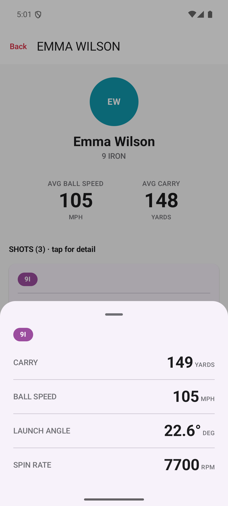
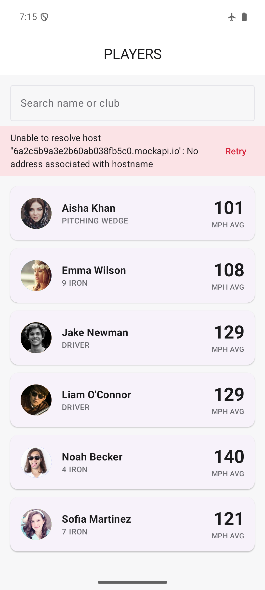

# Architecture & Design Decisions

A short tour of how the Golf Performance Tracker is built and *why* — aligned with Rapsodo's
principles (customer focus, achieve more with less, fail fast, team accountability).

## Demo

| Players (light) | Player detail + stats (dark) | Shot bottom sheet | Offline (cached) |
|---|---|---|---|
|  |  |  |  |

- **Players** — avatars loaded from the API (Coil), name, club, avg ball speed; live search.
- **Detail** — animated count-up hero stats, per-club stat pills, a custom-Canvas shot map, and the shot list.
- **Shot sheet** — tap any shot for full metrics in a Material 3 bottom sheet.
- **Offline** — airplane mode: cached players + avatars still render, with a transient refresh error.

## Layered MVVM + Repository (Clean Architecture)

```
┌──────────────────────────────────────────────────────────────┐
│ UI (Jetpack Compose)                                           │
│   PlayerListScreen / PlayerDetailScreen + components           │
│        ▲ observes StateFlow        │ sends events (tap, query) │
├────────┼───────────────────────────┼───────────────────────────┤
│ Presentation (ViewModel)                                       │
│   PlayerListViewModel / PlayerDetailViewModel                  │
│   expose immutable UiState via StateFlow                       │
├────────┼───────────────────────────────────────────────────────┤
│ Domain (pure Kotlin)                                           │
│   model: Player, Shot   ·   repository: interfaces             │
├────────┼───────────────────────────────────────────────────────┤
│ Data                                                           │
│   PlayerRepositoryImpl / ShotRepositoryImpl  (Single Source    │
│   of Truth) ── reads Room ── writes network results into Room  │
│      ├─ remote: Retrofit + Moshi (GolfApi, DTOs)               │
│      └─ local:  Room (DAO, entities, @Relation)                │
└────────────────────────────────────────────────────────────────┘
```

**Unidirectional data flow:** state flows down (`StateFlow<UiState>` → Compose), events flow up
(`onQueryChange`, `onPlayerClick`, `refresh`). State lives in the ViewModel, so configuration
changes (rotation) and process death are handled by design.

## Single Source of Truth (offline-first)

The repository **only ever reads from Room**; the network **only ever writes into Room**.

```
observePlayers(): Flow<List<Player>>   ←  Room (always the read source)
refreshPlayers(): Result<Unit>         →  GolfApi → upsert into Room
```

Because the UI observes a Room `Flow`, a successful refresh updates the screen automatically,
and the app works fully offline from cache. A refresh failure is returned as a `Result` and
surfaced as a transient banner **without clearing cached data**.

## Key decisions & tradeoffs

| Decision | Why | Tradeoff |
|---|---|---|
| Compose + StateFlow (over XML/LiveData/DataBinding) | Modern, less boilerplate, lifecycle-aware state | Brief listed DataBinding; architecture is identical either way |
| Single data-class `UiState` (not sealed Loading/Success/Error) | Offline-first needs cache **and** error shown together | Slightly less "pure" than a sealed type |
| Three models: DTO / Entity / domain | Network, DB, and app shapes evolve independently | More mapping code (kept as tiny pure functions) |
| Separate `PlayerRepository` / `ShotRepository` | One concern each (ISP), independently testable | Two classes instead of one |
| Hilt DI | Compile-time validated graph; first-class ViewModel + WorkManager support | Heavier setup than Koin |
| `@Binds` for interfaces, `@Provides` for constructed deps (Retrofit/Room) | `@Binds` generates no factory body | — |
| Injected `CoroutineDispatcher`s | Swap for `TestDispatcher` → deterministic tests | One more module |
| Three Gradle modules (`:app` / `:data` / `:domain`) | Enforces the layer boundary at compile time; `:domain` stays framework-free and fast to test | More Gradle config than a single module |
| Room `exportSchema = true` | Migrations stay reviewable/testable | A schema file per version |
| WorkManager + `NetworkType.CONNECTED` | Guaranteed, constraint-aware background sync | 15-min minimum period |
| Client-side search filter | Trivial for this dataset; no per-keystroke network | Would move to a Room `LIKE` query at scale |

## UI / design language

Data-forward "athletic dashboard": big ink-dark numbers, quiet uppercase labels, neutral
chrome, brand red reserved for accents (metric column headers), and **color used only for
category** — club badges follow Rapsodo's club palette and player avatars get a stable
per-name color. Light & dark themes via Material 3 `ColorScheme`s. A count-up animation on the
hero stats and animated list insertion/removal (visible when filtering) provide motion; tapping
a shot opens a Material 3 **bottom sheet** with the shot's full metrics. The detail screen
also includes a **custom Compose `Canvas` shot map** (carry × launch, colored by club) and a
per-club stat-pill row — the "custom views for visualizing performance metrics" bonus.

## Testing strategy

- **Pure JVM unit tests** (`./gradlew testDebugUnitTest`): Moshi DTO parsing, DTO↔Entity↔domain
  mappers, ViewModel state for list/search/detail (Turbine + fakes + a `MainDispatcherRule`),
  and the club-color mapping.
- **Compile-time verification**: Room's KSP processor validates every `@Query` against the
  schema at build time; Hilt validates the DI graph (including the `@HiltWorker`) at build time.
- **Deferred (honest gaps):** instrumented Room DAO test and a WorkManager worker test need a
  device/Hilt test harness; the worker logic is thin (delegates to the tested repository).

## Possible next steps

Paging 3 for large player lists (deliberately omitted here — over-engineering for a 6-item
list), further splitting a `:ui` module out of `:app`, and bundling the condensed brand fonts
(Oswald / Barlow Condensed) used in the design language.
